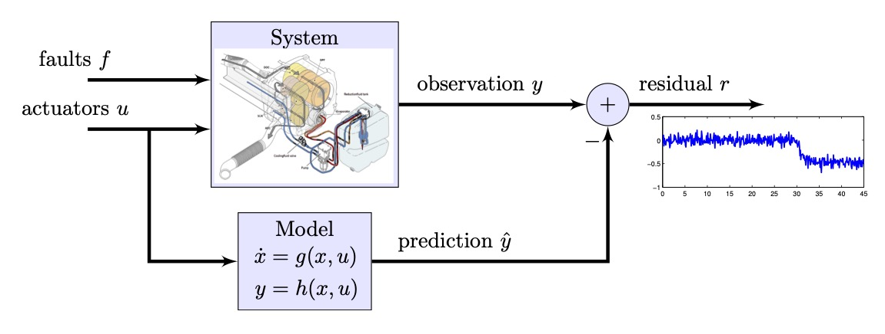
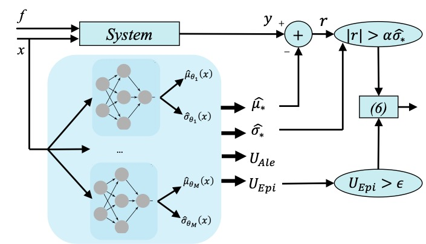
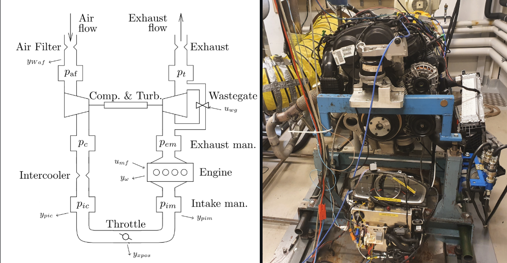
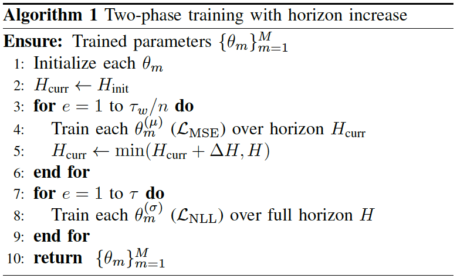
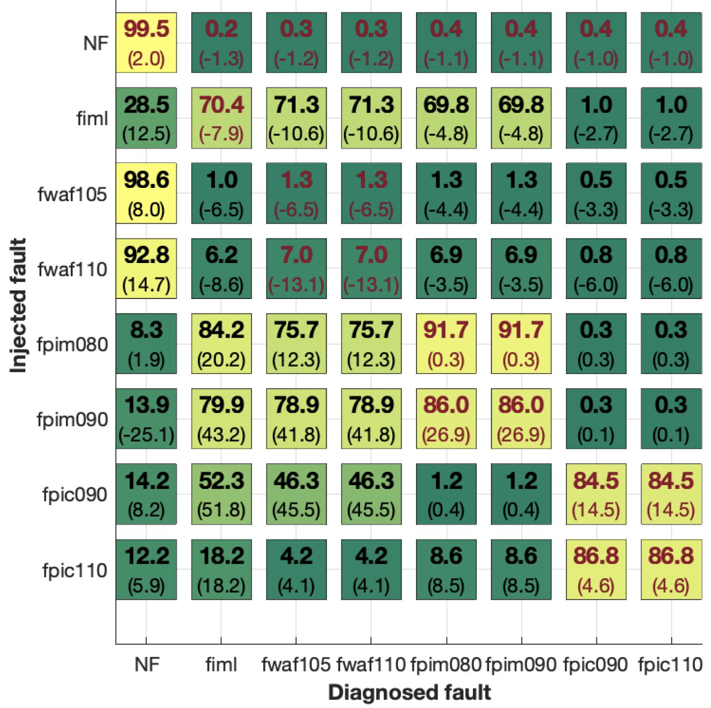

# Probabilistic Machine Learning for Uncertainty-Aware Diagnosis of Industrial Systems

[]()
[]()
[]()
[]()
<!-- []() -->
[]()
<!-- []() -->


This repository contains the implementation of our diagnostic framework that integrates **ensemble probabilistic machine learning** into **consistency-based fault diagnosis**. We supply a baseline model that can be used to train and evaluate the residuals on our open combustion engine dataset, but the code can be easily modified to work with other datasets and models. The code utilizes [PyTorch](https://pytorch.org/docs/stable/index.html) for its functionality.

<p align="center">
  
  <br/>
  <em>Visualization of consistency based diagnosis logic.</em>
</p>

<p align="center">
  
  <br/>
  <em>Visualization of proposed framework.</em>
</p>

---

- [Installation](#installation)
  - [Docker](#docker)
- [Dataset](#dataset)
- [Usage](#usage)
- [Related Work](#related-work)
- [Cite](#cite)
- [Contributing](#contributing)

## ⚙️ Installation

There are several alternatives to installation, depending on your needs and preferences. Our recommendation and personal preference is to use <b>containers</b> for reproducibility and consistency across different environments. We have provided a <code>Dockerfile</code> for this purpose which uses the <b>mamba</b> package manager to create the environments. It utilizes the same <code>environment.yml</code> file that could also be used to create a local conda environment if desired. Additionally, we provide a <code>requirements.txt</code> file for those who prefer to use <code>pip</code> for package management. All necessary files to install the required dependencies are found in the [`build`](build) directory.

##  Docker
Docker is a widely adopted platform for automating the deployment and management of containerized applications. It is suitable for users familiar with containers or those needing an isolated runtime environment.
Click [here](https://www.docker.com/get-started/) for Installation Instructions

## 📂 Dataset
This project uses the no-fault data from the baseline configuration of the [LiU-ICE Industrial Fault Diagnosis Benchmark](https://vehsys.gitlab-pages.liu.se/diagnostic_competition/).
Replace the data path in your configs to use your own dataset.

<p align="center">
  
  <br/>
  <em>Schematic and actual presentation of engine air path.</em>
</p>

## Data Loading ##
In [`utils/data_utils.py`](utils/data_utils.py), you will find the necessary functionality for processing and loading the data into PyTorch training pipelines. It includes:

<code>create_sequence</code>: A functionality that provides the proper loading format for scheduler.

<code>load_and_normalize_data</code>: Normalize the dataset in respect to the statistical distribution of the nominal operation.


## 🚀 Usage

The workflow is managed by [run_script.py](run_script.py), which sets seeds, launches training [main.py](main.py) and evaluation [Evaluate.py](Evaluate.py). Make sure to pass experiment hyperparameters (schedulers setting, ensemble properties, etc.) through command-line arguments.

```bash
python run_script.py
```

## Modeling
Most of the modules are all based on a simple LSTM architecture with probabilistic output. 

```bash
class Probabilistic_RNN(nn.Module):
    def __init__(self, input_dim):
        super(Probabilistic_RNN, self).__init__()
        self.lstm = nn.LSTM(input_dim, 64, num_layers = 1, batch_first=True)
        self.fc_mean = nn.Linear(64, 1)
        self.fc_std = nn.Linear(64, 1)
    
    def forward(self, x):
        lstm_out, _ = self.lstm(x)
        mean = self.fc_mean(lstm_out)
        std = torch.log(1 + torch.exp(self.fc_std(lstm_out)))
        return mean, std
```

The architecture is designed to be modified using standalone configuration files provided in the [`residuals`](residuals) directory, which are loaded into the model classes. Consult the [📚 Related Work](#-related-work), to get more information on this matter.

## Scheduler
The scheduler is designed to change the objective from MSE loss to Negative Log Likelihood, the prediction horizon of the regression model is increased as the training evolves due to stability issues encountered in the long workshop test setups.

<p align="center">
  
  <br/>
  <em>Two-phase training scheduler with increasing horizon.</em>
</p>

## Evaluation
The trained models will be saved in [`save_models`](save_models), which includes each individual trained model alongside the ensembled results evaluated on the test data set.
Alternatively you can use the pre-trained models to evaluate your results using the [Engine.ipynb](Engine.ipynb).

<p align="center">
  
  <br/>
  <em>Fault isolation performance results.</em>
</p>

## 📚 Related Work
We have been working with neural network residual generation in several research projects, resulting in multiple published papers. If you're interested in learning more about our findings, please refer to the following publications:

 - Mohammadi, A., *et al.* **“Consistency-based diagnosis using data-driven residuals and limited training data”**, *Control Engineering Practice*, 2025. [Link to paper](https://www.sciencedirect.com/science/article/pii/S0967066125000462)
 - Mohammadi, A., *et al.* **“Analysis of Numerical Integration in RNN-Based Residuals for Fault Diagnosis of Dynamic Systems”**, *Journal Name*, Year. [Link to paper](https://www.sciencedirect.com/science/article/pii/S2405896323018190)


## 📝 Cite
If you find the contents of this repository helpful, please consider citing the papers mentioned in the [📚 Related Work](#-related-work) section.
## 🤝 Contributing
We welcome contributions to the project, and we encourage you to submit pull requests with new features, bug fixes, or improvements. Any form of collaboration is appreciated, and we are open to suggestions for new features or changes to the existing codebase.  
Feel free to [email us](mailto:armanmohammadi7394@gmail.com) if you have any questions or notice any issues with the code.
## License

Apache License 2.0 — see [`LICENSE`](LICENSE) for details.