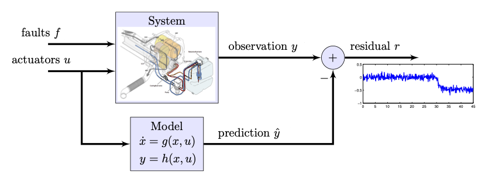

# Probabilistic Machine Learning for Uncertainty-Aware Diagnosis of Industrial Systems

<!--  -->

<!--  -->

This repository contains the implementation of our diagnostic framework that integrates **ensemble probabilistic machine learning** into **consistency-based fault diagnosis**. We supply a baseline model that can be used to train and evaluate the residuals on our open combustion engine dataset, but the code can be easily modified to work with other datasets and models. The code utilizes [PyTorch](https://pytorch.org/docs/stable/index.html) for its functionality.

  
   
  <em>Visualization of consistency based diagnosis logic.</em>

  
   
  <em>Visualization of proposed framework.</em>

---

- [Installation](#installation)
  - [Docker](#docker)
- [Dataset](#dataset)
- [Usage](#usage)
- [Related Work](#related-work)
- [Cite](#cite)
- [Contributing](#contributing)

## ⚙️ Installation

There are several alternatives to installation, depending on your needs and preferences. Our recommendation and personal preference is to use <b>containers</b> for reproducibility and consistency across different environments. We have provided both a <b>Dockerfile</b> for this purpose which uses the <b>mamba</b> package manager to create the environments. It utilizes the same <code>environment.yml</code> file that could also be used to create a local conda environment if desired. Additionally, we provide a <code>requirements.txt</code> file for those who prefer to use <code>pip</code> for package management. All necessary files to install the required dependencies are found in the build directory.

## ⚙️ docker

## 📂 Dataset
For the combustion engine dataset, we use the no-fault data from the 
The baseline configuration targets an open **LiU-ICE Industrial Fault Diagnosis Benchmark**, available [here](https://vehsys.gitlab-pages.liu.se/diagnostic_competition/). Replace the data path in your configs to use your own dataset.

  
   
  <em>Schematic and actual presentation of engine air path.</em>

## Data Loading ##
In [`utils/data_utils`](utils/data_utils), you will find the necessary functionality for processing and loading the data into PyTorch training pipelines. It includes:

<code>create_sequence</code>: A functionality that provides the proper loading format for scheduler.

<code>load_and_normalize_data</code>: Normalize the dataset in respect to the statistical distribution of the nominal operation.

## 🚀 Usage

The workflow is managed by [`run_script.py`](run_script.py), which sets seeds, launches training (`main.py`)(main.py) and evaluation (`Evaluate.py`)(Evaluate.py). Make sure to pass experiment hyperparameters (schedulers setting, ensemble properties, etc.) through command-line arguments.

  
   
  <em>Two-phase training scheduler with increasing horizon for stability.</em>

$ python run_script.py

Alternatively you can use the pre-trained models included in saved_models to evaluate your results using the [`Engine.ipynb`](Engine.ipynb).

## 📚 Related Work
We have been working with neural network residual generation in several research projects, resulting in multiple published papers. If you're interested in learning more about our findings, please refer to the following publications:
 
## 📝 Cite
If you find the contents of this repository helpful, please consider citing the papers mentioned in the related work section.
## 🤝 Contributing
We welcome contributions to the project, and we encourage you to submit pull requests with new features, bug fixes, or improvements. Any form of collaboration is appreciated, and we are open to suggestions for new features or changes to the existing codebase.
Feel free to email us if you have any questions or notice any issues with the code.
## License

Apache License 2.0 — see [`LICENSE`](LICENSE) for details.